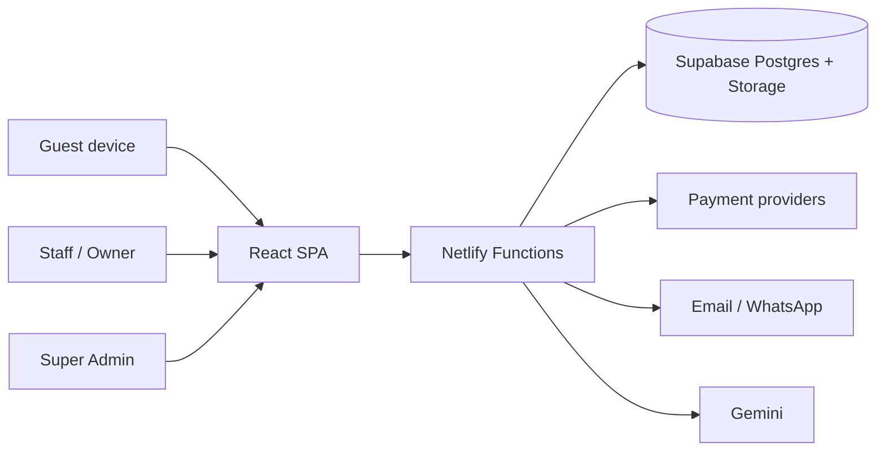

# Overall Architecture

**Status:** Current Implementation described; Approved Direction noted where different.

---

## Context

## Layers

| Layer | Technology | Role |
|-------|------------|------|
| Presentation | React 19, Vite, Tailwind, React Router | SPA for public check-in, business dashboard, admin |
| Edge / API | Netlify Functions | Auth-sensitive operations, exports, payments webhooks |
| Data | Supabase (Postgres, Storage) | Businesses, bookings, employees, entitlements, audit |
| Integrations | Resend, payment PSPs, Gemini | Email, billing, AI |

## Tenancy

**Current Implementation:** Primarily **single business_id** tenant per session.  
**Approved Direction:** Business package supports **multiple establishments** under one business account—requires schema and authz evolution.

## Key flows

1. **Guest check-in** — public/dynamic check-in → create booking → optional confirmation.  
2. **Business operations** — login → dashboard tabs (check-ins, reports, staff, settings, billing).  
3. **Subscription** — plan on `businesses` + rows in `entitlements` → status via `get-subscription-status`.  
4. **Super admin** — approve businesses, grants, platform ops.  

See also [Frontend.md](./Frontend.md), [Backend.md](./Backend.md), [Subscription-Architecture.md](./Subscription-Architecture.md).
